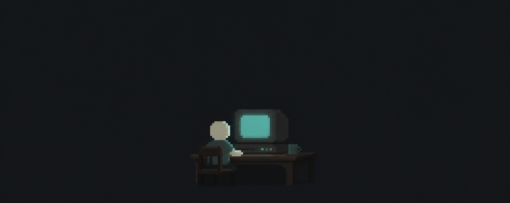
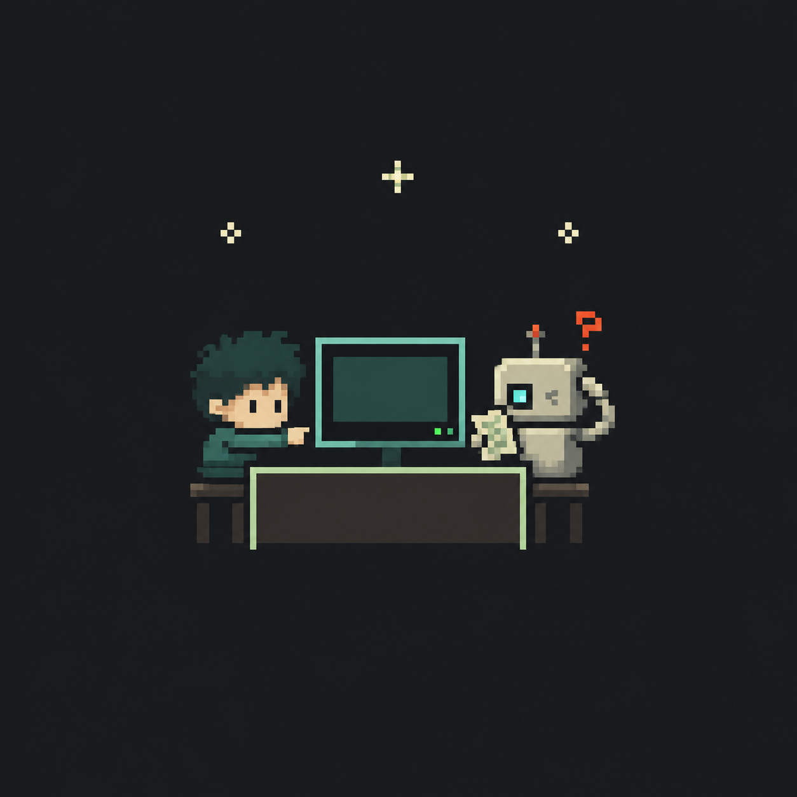
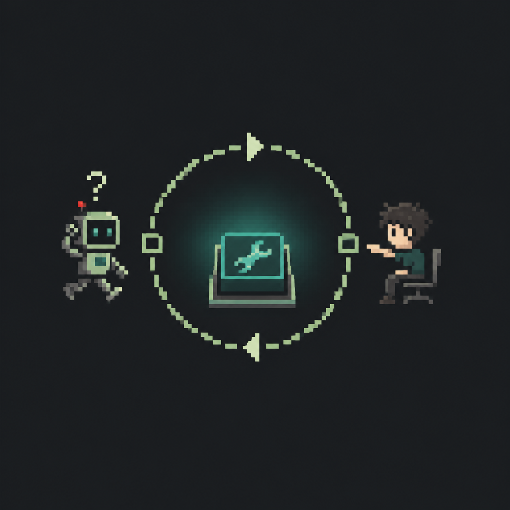
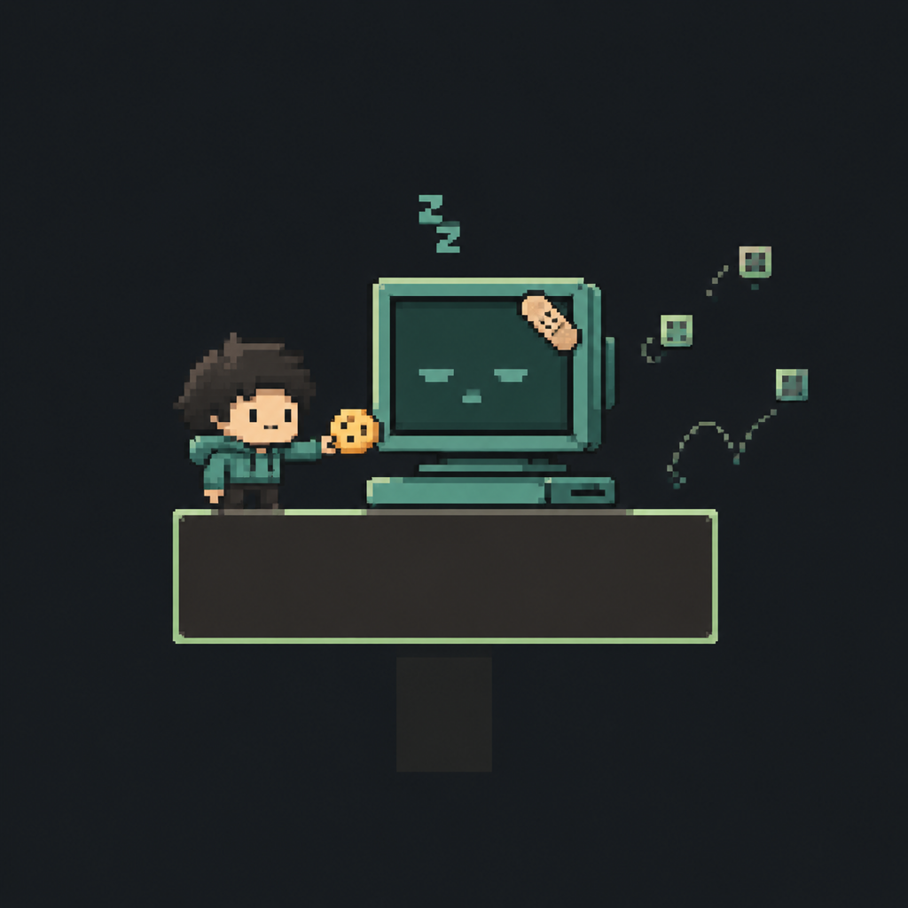

<div align="center">



<p>
  
  
  
</p>

</div>

## Hello, I'm Yuan

I'm a beginner developer exploring how **agent systems** work: models, tools, memory, and the small decisions that make an agent useful.

This profile is a public workshop for notes, experiments, mistakes, and the occasional successful run.

## What I'm Exploring

<table>
  <tr>
    <td width="33%" valign="top">
      <h3>Agent Loops</h3>
      <p>Planning, tool calling, structured outputs, and learning how an agent moves from intent to action.</p>
    </td>
    <td width="33%" valign="top">
      <h3>Useful Context</h3>
      <p>RAG, memory, retrieval, and giving a model the right information at the right time.</p>
    </td>
    <td width="33%" valign="top">
      <h3>Small Experiments</h3>
      <p>Building tiny things first, then keeping the parts that are actually useful.</p>
    </td>
  </tr>
</table>

## Visual Log

<table>
  <tr>
    <td width="33%" valign="top">
      
      <p align="center"><code>teach the robot</code></p>
    </td>
    <td width="33%" valign="top">
      
      <p align="center"><code>tool call loop</code></p>
    </td>
    <td width="33%" valign="top">
      
      <p align="center"><code>debug with snacks</code></p>
    </td>
  </tr>
</table>

## Current Mission

```text
[x] Open the editor
[x] Survive the first Git push
[ ] Understand an agent loop
[ ] Build a tool-using agent
[ ] Connect an agent to real data
[ ] Deploy something that does not immediately crash
```

## Toolbox

<p>
  
  
  
  
  
  
  
  
</p>

`learning` · `experimenting` · `still reading the docs`

## Experiments

| ID | Project | Status |
| --- | --- | --- |
| `001` | Personal profile | `online` |
| `002` | First agent experiment | `not spawned yet` |
| `003` | Something weird and useful | `loading...` |

## Known Issues

```text
> sometimes gets distracted
> occasionally forgets why the code worked
> documentation reading skill is still installing
> coffee dependency is missing
```

<div align="center">

<sub>Build patiently. Verify often. Keep the useful parts.</sub>

</div>
